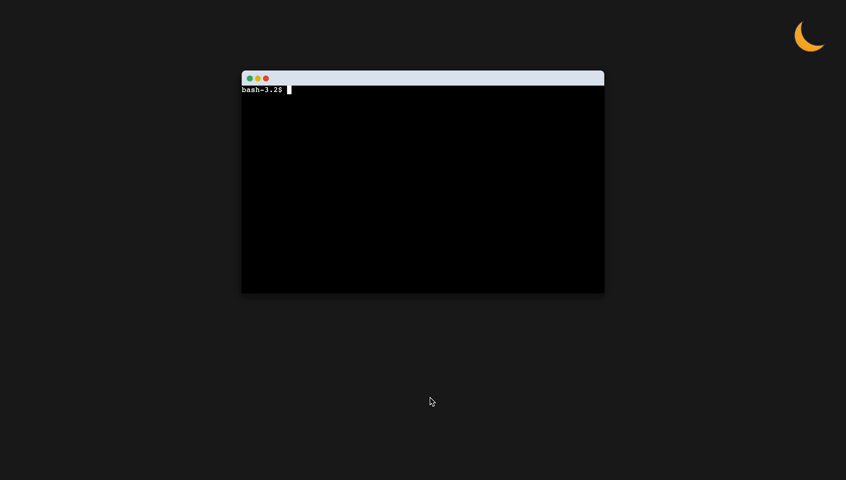

## React Web Terminal Emulator

**A web-based terminal emulator built with React, Node.js, xterm.js, node-pty, and Socket.IO.**

### Demo

### Inspiration

This project draws inspiration from popular terminal emulators like the one integrated within Visual Studio Code. The technology stack used here (xterm, node-pty) is a common combination employed by many such emulators.

### Installation

1. Clone: `git clone https://github.com/Nikhiladiga/web-terminal-emulator.git`
2. Run backend:
   - `cd terminal-emulator-backend`
   - `npm install`
   - `npm start`
3. Run frontend:
   - `cd terminal-emulator-frontend`
   - `npm install`
   - `npm run dev`

### License

MIT
